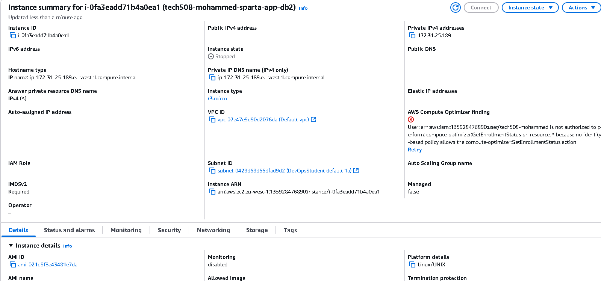

**Introduction to Bash Scripting**
Bash stands for Bourne-Again SHell. Bash is a Unix shell and command language. It is widely available on various operating systems, and it is also the default command interpreter on most Linux systems.

As with other shells, you can use Bash interactively directly in your terminal, and also, you can use Bash like any other programming language to write scripts. This book will help you learn the basics of Bash scripting including Bash Variables, User Input, Comments, Arguments, Arrays, Conditional Expressions, Conditionals, Loops, Functions, Debugging, and testing.

Bash scripts are great for automating repetitive workloads and can help you save time considerably. For example, imagine working with a group of five developers on a project that requires a tedious environment setup. In order for the program to work correctly, each developer has to manually set up the environment. That's the same and very long task (setting up the environment) repeated five times at least. This is where you and Bash scripts come to the rescue! So instead, you create a simple text file containing all the necessary instructions and share it with your teammates. And now, all they have to do is execute the Bash script and everything will be created for them.

The reason why we create the Database first is because we need the private ip address in order to create the front end otherwise it wouldnt work and give the private ip to the front end.

# Automate User Data Level 3

## 1. Launch a New App Database Instance
- **Name**: `tech508-mohammed-sparta-app-db`
- **AMI**: Ubuntu 22.04 LTS
- **Key Pair**: Use your designated key pair
- **Security Group**: `tech508-mohammed-sparta-app-db-SSH`
  - **Inbound Rules**:
    - SSH (22) from `0.0.0.0/0`
    - Custom TCP (Port Range: 27017, Description: SPARTA APP) from `0.0.0.0/0`
- **Advanced Settings**:
  - Scroll to bottom and paste `prov-db.sh` script
- **Launch the Instance**



### Connect to DB Instance
```bash
# Open Git Bash terminal
cd .ssh
chmod 400 "tech508-mohammed-aws.pem"
ssh -i "tech508-mohammed-aws.pem" ubuntu@ec2-3-248-213-130.eu-west-1.compute.amazonaws.com
sudo systemctl status mongod  # Check if MongoDB is running
```

- Go back to instance and copy the **private IP**.

---

## 2. Launch a New App Instance
- **Name**: `tech508-mohammedtest-sparta-app`
- **AMI**: Ubuntu 22.04 LTS
- **Key Pair**: Use your designated key pair
- **Security Group**: `tech508-mohammed-sparta-app-SSH`
  - **Inbound Rules**:
    - SSH (22) from `0.0.0.0/0`
    - HTTP (80) from `0.0.0.0/0`
    - Custom TCP (Port Range: 3000, Description: SPARTA APP) from `0.0.0.0/0`
- **Advanced Settings**:
  - Scroll to bottom and paste `prov-app.sh` script
  - **IMPORTANT**: Paste the **private IP** from the **DB instance** into the `export DB_HOST` section of the script
- **Launch the Instance**

### Connect to App Instance
```bash
# Open Git Bash terminal
cd .ssh
chmod 400 "tech508-mohammed-aws.pem"
ssh -i "tech508-mohammed-aws.pem" ubuntu@ec2-34-244-208-198.eu-west-1.compute.amazonaws.com
sudo systemctl status nginx  # Check if NGINX is running
```

- Copy **public IP** and paste it into browser (start with `http://`)
- Append `/posts` to the URL to check functionality

---
